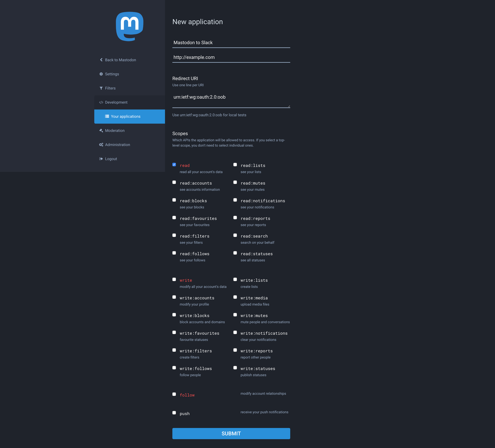

# Mastodon-to-Slack
Mastodon-to-Slack is a simple Slack integrations tool to post a toot to a Slack channel by using [Incoming Webhooks](https://api.slack.com/incoming-webhooks).

## Setup
To use this tool you need a few configurations.

### Create a File of Environment Variables
1. Copy `.env.sample` file

```
$ cp .env.sample .env
```

2. Fill in `MASTODON_INSTANCE_HOST` and `MASTODON_USERNAME`

### Generate a Mastodon Access Token
1. Access `https://<YOUR_MASTODON_INSTANCE_HOST>/settings/applications/new`
2. Create a new application by following the screenshot below



| Item | Value |
|:---:|:---:|
| Application name | Anything is OK |
| Application website | Anything is OK |
| Redirect URI | `urn:ietf:wg:oauth:2.0:oob` |
| Scopes | Only read |

3. Click the `SUBMIT` button
4. Copy your access token
5. Paste it to `MASTODON_ACCESS_TOKEN` in `.env`

### Create an Incoming Webhook
1. Access [Slack App Directory](https://slack.com/apps)
2. Search Incoming WebHooks
3. Click the `Add Configuration` button
4. Select a channel you want to integrate
5. Click the `Add Incoming WebHooks integration` button
6. Copy your Webhook URL
7. Paste it to `SLACK_WEBHOOK_URI` in `.env`
8. [OPTIONAL] Change integration settings

## Install RubyGems
```
$ bundle install
```

## Usage
The usage is very simple. All you need to do is run the following command:

```
$ ruby src/mastodon_to_slack.rb
```

Note that you must run this command in a project root directory:

```
# Bad
$ cd src
$ ruby mastodon_to_slack.rb

# Good
$ ruby src/mastodon_to_slack.rb
```

Toot something, and this tool will post a Mastodon status URL to a Slack channel!

To stop this tool just send SIGINT signal (press `Ctrl-C`).
